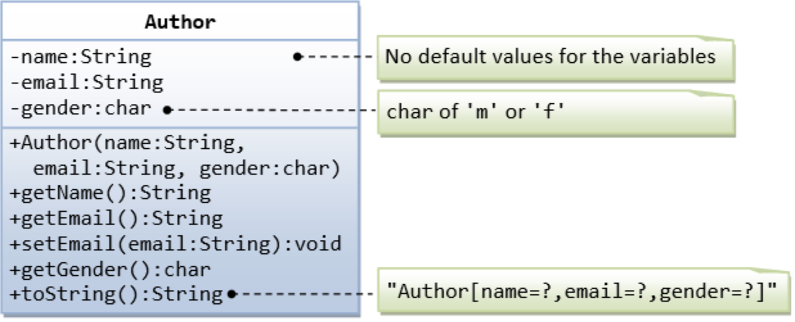
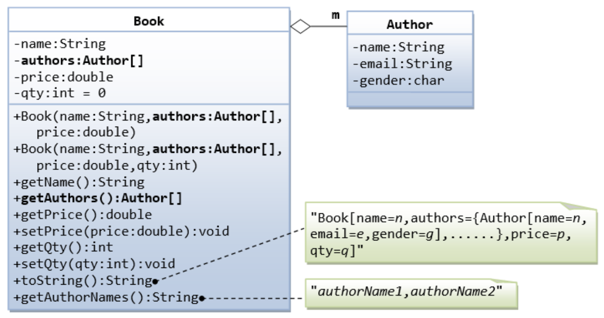
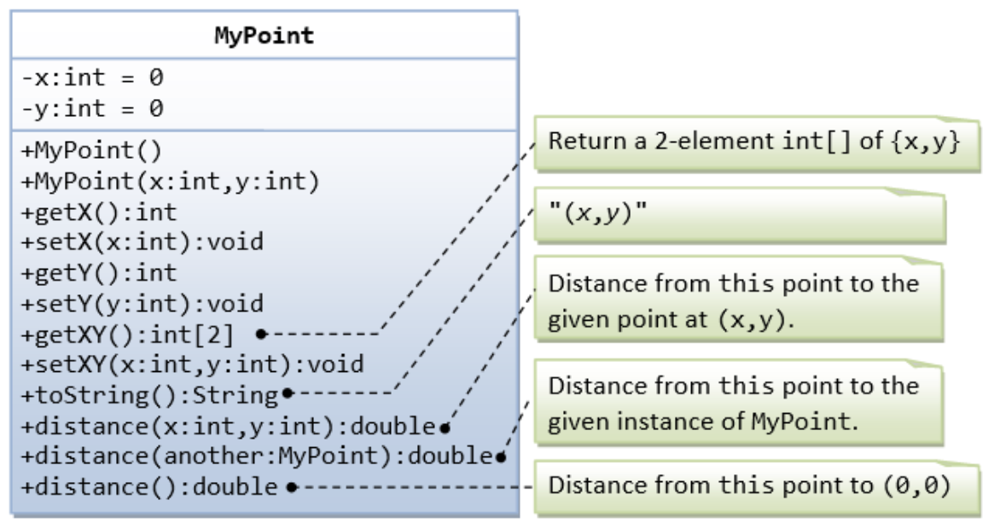
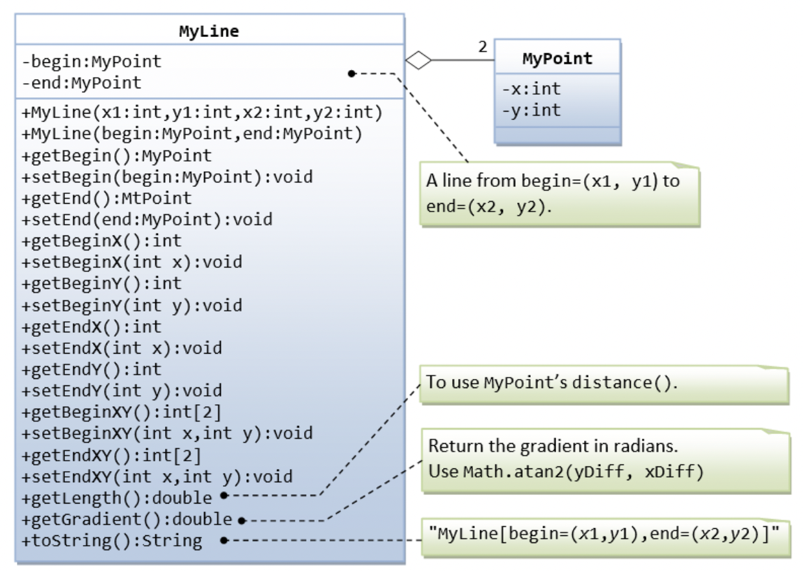
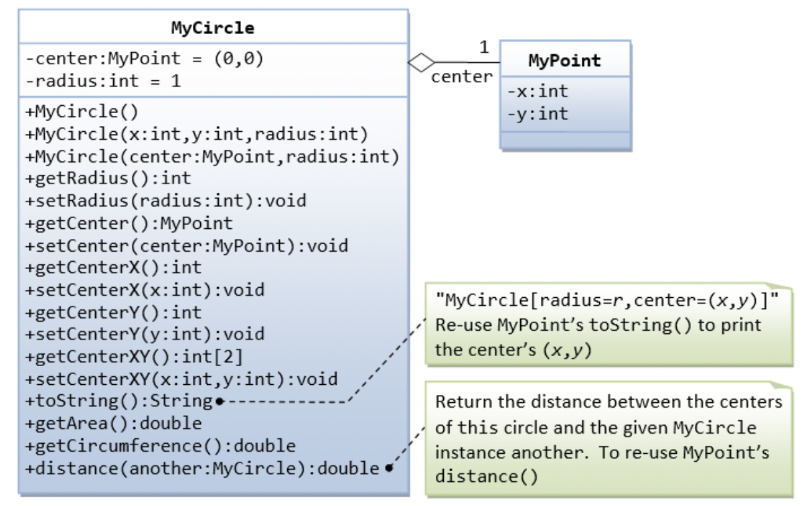

# Programming 2 - Lab 7

This template repository is the starter project for Programming 2 Lab 7. Written in Java, and tested with Gradle/JUnit.

### Question(s)

1. Create a UML class diagram for Lab 2, Q4. You can use draw.io to draw your diagram.

2. Implement the following classes based on the UML classes diagrams:

3. Implement the following classes based on the UML classes diagrams:

